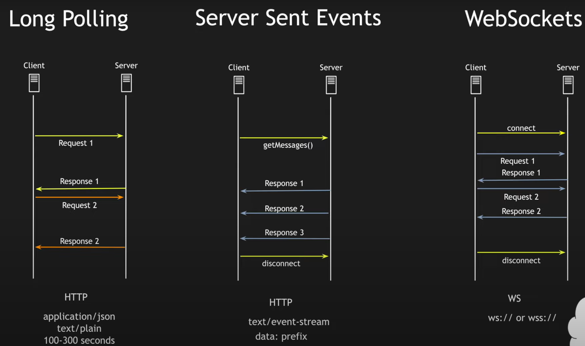

- react uses javascript and html. so actual code is hybrid mix of these two languages (jsx).
- everything is a component. you design modular components to use them multiple times (it seems like abstraction in practice).
- npm create vite@latest (command to create a new project).
- package.json has all the required packages. to install all the packages run - npm install
- there is a div element with title 'root' in index.html. all the code goes inside this root element and code needs to be placed in src folder.
- `npm run dev` to run the react server.
- main.jsx is where the react application begins. main.jsx import App.jsx which has all the code.
- components are just functions that return something. name convention for components is to start with capital letter.
- components can be created in a different file which can be imported.
- criteria for something being jsx is it needs to have a parent element and everything else is inside that.
- if we need to return multiple elements at same level instead of everything inside a parent element, a Fragment can be used. Fragment is a place holder for parent element. its an empty html tag (<></>).

```JSX
function App() {

  return (
    <>
      <div>
        <h1>Hello React</h1>
      </div>
      <div>
        <h1>Hello React</h1>
      </div>
    </>
  )
```

- once you define a component as a function, to use it, just use the name of component as html tag. for a component name Test, <Test /> will return whatever is there in the component.
- to control the behaviour of components props (properties) can be used as arguments. when creating a component use the prop in within {} and when using it somewhere pass that property as a component.
- defining a component with a prop

```JSX
function Text({display_text}) {
  return (
    <div>
      <h1>{display_text}</h1>
    </div>
  )
}
```
- using the component with a prop
```JSX
function App() {

  return (
    <>
      <div>
        <h1>Hello React</h1>
      </div>
      <Text display_text="this is a prop"/>
      <h1>Hello React</h1>
      <Text />
    </>
  )
```
 - usedState is built-in react hook to declare and track a variable. whenever there is a change in the state react re-renders the changed part.
 - const [state, setState] = useState(initialValue)
 - useState accepts an initial value it can be a valid JavaScript value.
 - state holds the current value of the state
 - setState is func that can be used to update state value
 - const is JavaScript key word to declare a constant
 - [state, setState] - this syntax de-structures the input and assigns it to state
 - the purpose of setState is react uses a virtual dom and it only updates the changed part in the actual dom. state is immutable. setState creates a new reference of state and does the difference between old and new reference to re-render the changed components.
  
- useEffect lets you isolate side-effects from rendering logic(pure function returns the same output for same input again and again)
- making an async call to api is a side effect
- console.log is a side effect
- dom manipulation, writing to storage and IO manipulations are side effects.
- anything that is not part of component output is a side effect.

```JSX
// runs after every render
useEffect(() => {
  // Side-Effect
});
```

```JSX
//runs once after mounting (initial render)
useEffect(() => {
  // Side-Effect
}, []);
```

```JSX
//runs only after state changes
useEffect(() => {
  // Side-Effect
}, [state]);
```

```JSX
//runs only after props changes
useEffect(() => {
  // Side-Effect
}, [props]);
```

```JSX
//runs only after props and/or state changes
useEffect(() => {
  // Side-Effect
}, [props, state]);
```

```JSX
//runs only after props and/or state changes
useEffect(() => {
  // Side-Effect
  return () => {
    //Side-Effects cleanup
  }
}, [props, state]);
```

common HTTP (Hypertext transform protocol) methods - verbs of the internet
- GET (200) - to retrieve data from the server. data is not getting modified.
- POST (201) - send a new data to the server to create new data on the server
- PUT (200) - to replace an existing resource with new resource
- PATCH (200) - to update the resource partially
- DELETE (200) - to delete a resource
- HEAD - to get only the headers
- OPTIONS - to see which methods are allowed on a particular resource
- TRACE - to echo back a request (mostly used for debugging)
- CONNECT - is a tunnel for secure communication. it establishes a secure connection with the server.

#### HTTP Long Polling vs Server Sent Events vs WebSockets
- these are used when server needs to initiate a transaction/request. usually the client is the one making requests.
- Long Polling
  - involves sending an initial request from client and and it stays open until new data is available or a timeout happens. once the response comes (empty response in case of timeout), immediately a request gets made from the client to the server to keep the connection alive
  - uses HTTP protocol.
  - this is easy to implement
  - latency increases because the request is waiting for a response
  - it is costlier as well since each requests gets killed when next polling happens
  - ordering of response is not reliable
- Server Sent Events
  - involves the client sending an initial request and the server keeps sending the data. unlike Long Polling here the initial request is not closed until the application is disconnected. live streaming of sporting events is a good example.
  - uses HTTP protocol. media type x/event-stream and the response it has a data: prefix by default
  - easy to implement because its an HTTP request. you create an event and keep on listening so its very lightweight
  - it is unidirectional. you can send another request to modify the response.
  - does not support binary data format only supports text format
  - there tends be a limit on max open connections allowed.
- WebSockets
  - involves the client initiating a request and the information flows in both directions. these flows are asynchronous. this connection stays open until disconnected or timeout issue.
  - ws:// or wss://
  - bidirectional and asynchronous
  - support binary data transmission and lightweight as well since its a one time connection
  - no automatic recovery in case of failure




### JavaScript
Ways to declare variables - var, let and const
- var - older method and not being used much these days. var and let have global scope.

```JS
let firstName = 'Pamidi';
console.log(firstName);
firstName = 'Satya' //reassigning of variable
console.log(firstName);
let name; //declaring a variable without any data assigned

const a = 18;

a = 19; //this can't be done if the variable is a const
const a; //this can't be done as well with const

//use let if you know in advance that you have to reassign the value
//create an object as const then its properties can be reassigned directly

const student = {
  name: 'Satya',
  email: 'satya@gmail.com'
}

student.name = 'pamidi' //this can be done
```

Primitive Data Types - String, Number (integer or decimal), Boolean, Null, Undefined (has't been defined or assigned), Symbol (a built-in object to return symbols) and BigInt (numbers that are big which Number data type can not handle)

JavaScript is a dynamically-typed language. so no need to explicitly define data type of variables.

```JS

```